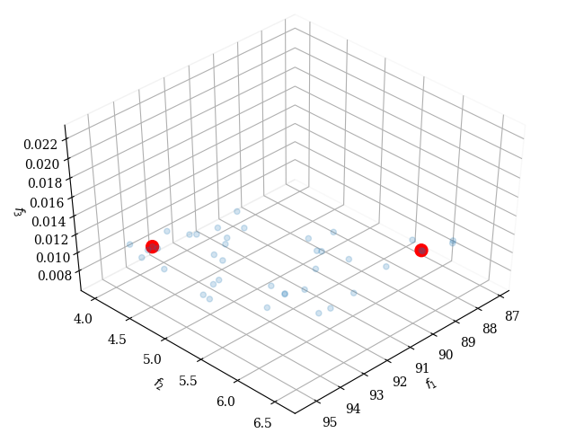

# Finish the MixPath
To finish the MixPath code

limingyao@ainirobot.com



Done:
- NSGA-II (use [pymoo](https://pymoo.org))
- Plot the result

TODO:
- SNPE/OPENVINO's LookupTable


## Accuracy 
According to https://github.com/kuangliu/pytorch-cifar
| Model             | Acc.        |
| ----------------- | ----------- |
| [VGG16](https://arxiv.org/abs/1409.1556)              | 92.64%      |
| [ResNet18](https://arxiv.org/abs/1512.03385)          | 93.02%      |
| [ResNet50](https://arxiv.org/abs/1512.03385)          | 93.62%      |
| [ResNet101](https://arxiv.org/abs/1512.03385)         | 93.75%      |
| [MobileNetV2](https://arxiv.org/abs/1801.04381)       | 94.43%      |
| [ResNeXt29(32x4d)](https://arxiv.org/abs/1611.05431)  | 94.73%      |
| [ResNeXt29(2x64d)](https://arxiv.org/abs/1611.05431)  | 94.82%      |
| [DenseNet121](https://arxiv.org/abs/1608.06993)       | 95.04%      |
| [PreActResNet18](https://arxiv.org/abs/1603.05027)    | 95.11%      |
| [DPN92](https://arxiv.org/abs/1707.01629)             | 95.16%      |
| **MixPath_S1(my)**                                    |**95.29%**   |

# MixPath: A Unified Approach for One-shot Neural Architecture Search

This repo provides the supernet of S<sub>1</sub> and our confirmatory experiments on NAS-Bench-101.


## 招聘 We Are Hiring！

Dear DL folks, we are opening several precious positions both for professionals and interns avid in AutoML/NAS, please send your resume/cv to zhangbo11@xiaomi.com. 全职/实习生申请投递至前述邮箱。  

## Requirements

```
Python >= 3.6, Pytorch >= 1.0.0, torchvision >= 0.2.0
```

## Datasets

CIFAR-10 can be automatically downloaded by `torchvision`. It has 50,000 images for
training and 10,000 images for validation.

## Usage

```
python S1/train_search.py \
    --exp_name experiment_name \
    --m number_of_paths[1,2,3,4]
    --data_dir /path/to/dataset \
    --seed 2020 \
```
```
python NasBench101/nas_train_search.py \
    --exp_name experiment_name \
    --m number_of_paths[1,2,3,4]
    --data_dir /path/to/dataset \
    --seed 2020 \
```

## Citation


```
@article{chu2020mixpath,
  title={MixPath: A Unified Approach for One-shot Neural Architecture Search},
  author={Chu, Xiangxiang and Li, Xudong and Lu, Yi and Zhang, Bo and Li, Jixiang},
  journal={arXiv preprint arXiv:2001.05887},
  url={https://arxiv.org/abs/2001.05887},
  year={2020}
}
```
